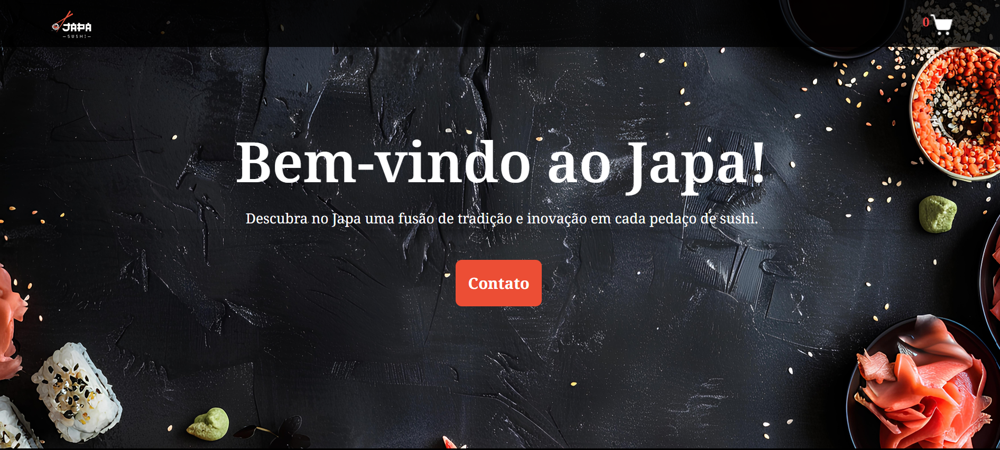

<h1 align="center">
  🍣
   Restaurante Japa
  

      
      
      
  

</h1>

Bem-vindo ao projeto do Restaurante Japa, uma aplicação web para exibir e pedir pratos de comida japonesa online. Este projeto foi desenvolvido utilizando React, e tem como objetivo proporcionar uma experiência interativa e intuitiva para os usuários.
[Visite o site](https://restaurante-seven-bice.vercel.app/)

## 🖼️ Visualização do Projeto

### Versão Desktop

### Versão Mobile

  

## 🔄 Funcionalidades

- Exibição de diferentes categorias de pratos de comida japonesa (combos, pratos quentes e bebidas).
- Adição de itens ao carrinho de compras.
- Navegação entre diferentes categorias de pratos.

## 🚀 Tecnologias Utilizadas

- 
- 
-  e 
- 
- 

## 🤝 Contribuição
Contribuições são bem-vindas! Sinta-se à vontade para abrir issues e pull requests para melhorias ou correções.

## 🌐 Contato
- 💻 **LinkedIn:** [Francine Cruz](https://www.linkedin.com/in/francine-ccruz/)
